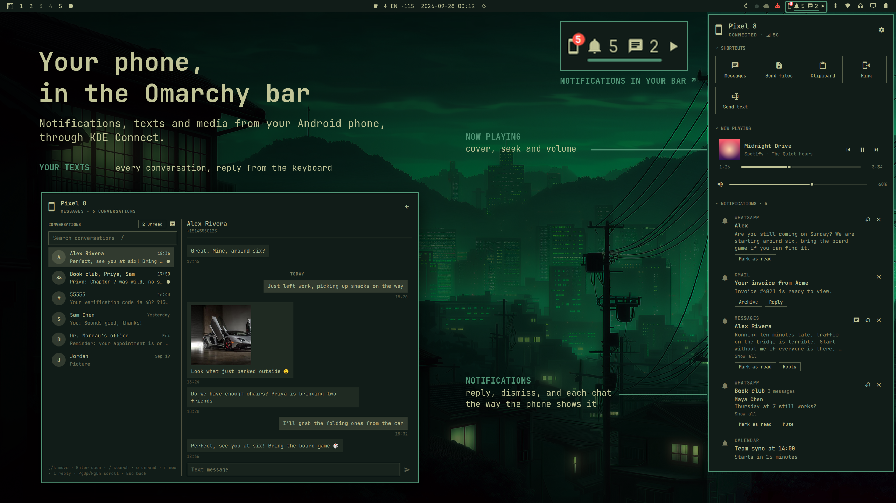

# Devices

Your phone in the [Omarchy](https://omarchy.org) bar, through
[KDE Connect](https://kdeconnect.kde.org/): notifications, texts, calls,
media and photos, without picking it up.

- **[Notifications](docs/panel.md)**: reply, dismiss, the app's own buttons.
- **[Messages](docs/messages.md)**: every conversation and picture; reply
  or start one from the keyboard.
- **[Calls](docs/calls-and-devices.md)**: who is calling, and a missed call
  to call or text back.
- **[Now playing and shortcuts](docs/panel.md)**: the phone's player; ring
  it, send files, the clipboard, a link.
- **[Gallery and files](docs/gallery-and-files.md)**: its newest photos and
  videos, and the files it sent you.
- **[Screen](docs/screen-and-apps.md)**: the phone's screen in a window
  here, with your mouse and keyboard (scrcpy, set up from the panel).
- **[Several devices](docs/calls-and-devices.md)**: a tab and a chip each.
- **[Setup](docs/getting-started.md)**: checks with fixes, a QR code for the
  app, a demo phone to look around first.

| Key | Action |
|---|---|
| Click / middle-click the pill | Open the panel / messages |
| `j` `k` · Enter | Move · activate |
| `r` · `x` | Reply to · dismiss a notification |
| `s` · `E` · Esc | Settings · edit the page · back |

## Privacy and safety

- Everything stays between the computer and your phone, over your own
  network. Devices sends nothing anywhere else.
- It never sends a text, rings the phone or plays anything on its own.
- The phone's screen needs Wireless debugging, which you turn on and pair
  yourself; only a computer that scanned your code can use it.
- Pictures from the phone are opened in a sandbox first: what you see is a
  copy made from their pixels, never the phone's file.
- It keeps only caches, in `~/.cache/sceny.devices/`. Drafts stay in
  memory.

## User guide

[Getting started](docs/getting-started.md) ·
[The panel](docs/panel.md) ·
[Messages](docs/messages.md) ·
[Gallery and files](docs/gallery-and-files.md) ·
[Screen and apps](docs/screen-and-apps.md) ·
[Calls and devices](docs/calls-and-devices.md) ·
[Settings](docs/settings.md) ·
[Troubleshooting](docs/troubleshooting.md) ·
[What's new](CHANGELOG.md)

## Internals

[How it works](docs/internals/how-it-works.md) ·
[Messages and media](docs/internals/messages-and-media.md) ·
[Development](docs/internals/development.md) ·
[Screenshots](docs/internals/screenshots.md)

MIT, © Sceny. Not affiliated with KDE or Omarchy.
