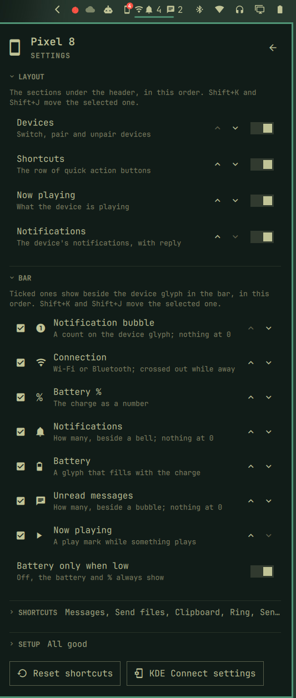

# Devices for Omarchy

**Your phone, on your desktop.** Read and answer your texts, catch every
notification, control what is playing and send files without picking up your
phone. Devices brings the phones and tablets you pair with
[KDE Connect](https://kdeconnect.kde.org/) into the [Omarchy](https://omarchy.org)
bar: the Linux answer to Windows Phone Link, in one panel that looks and moves
like the rest of the shell.


Jump to [Getting started](#getting-started) or [Under the hood](#under-the-hood).

## Your text messages, right in the panel


Not a button that opens another app: a full messaging view, built into the
panel and made for the keyboard.


- **Every conversation**, newest first, with unread marks, a one-click
  unread filter, and search across names, numbers and what was said.
- **The whole history**, loading as you scroll up, with day headers and
  picture messages (MMS) that open full size.
- **Reply and start new messages** without leaving the keyboard, with a
  recipient search over your contacts and past conversations.
- **From notification to reply in one click:** a text-message notification
  opens its conversation.
- **Fast by hand:** `j`/`k` to move, `/` to search, `u` for unread, `n` for a
  new message, Enter to reply. It even remembers the conversation you left
  open and keeps unsent drafts while you switch.

## Everything else, one click away


- **In the bar, only what you want:** the device's glyph, with a count
  bubble for new notifications and the battery once it runs low, by default.
  Add the connection, battery and percent, notification and unread-message
  counts, or a play mark, in the order you like. Dimmed while the device is
  away, urgent when it runs low. Click for the panel, middle-click for
  messages. The panel adds the link (Wi-Fi or Bluetooth)
  and the cellular signal bars and network type (`󰣸 LTE`).
- **Notifications** from the device, with inline reply, dismiss and the
  app's own actions.
- **Now playing:** the device's active media player, with the others a swipe
  away, a seek bar and its volume.
- **Shortcuts** you choose and order: Ring, Send files, Clipboard, Send
  text, Messages, Ping, Play/Pause, KDE Connect.
- **Send text or a link:** type it in the panel. Text lands on the device's
  clipboard, a link arrives ready to open, and Ctrl+Enter sends it as a ping
  instead, shown in a notification.
- **Several devices:** switch between them, pair, and accept or reject a
  pairing request with its verification key, right in the panel.
- **Phones, tablets and computers**, each with its own glyph; features follow
  what the device offers.

## Make it yours




- **Layout:** show, hide and order the sections (Devices, Shortcuts, Now
  playing, Notifications; empty ones stay out of the way), and fold any of them to a
  single line that still says what is in it (the track and its cover, the
  latest notification) or still works (folded shortcuts become a row of
  icons). Everything you arrange is remembered.
- **Bar:** tick what the bar shows beside the glyph and put it in order;
  with *Battery only when low* ticked, the battery and percent stay out of
  sight until it runs low.
- **Shortcuts:** tick the ones you want and put them in order.
- **Setup:** checks that KDE Connect is installed, running and let through
  the firewall, with a button to fix what is missing, plus the steps on the
  phone.
- Results appear as a toast over the panel (or Omarchy's on-screen display
  when it is closed), everything moves at one pace, and the whole panel works
  from the keyboard.

## Keyboard


`j`/`k` or arrows move between rows, `h`/`l` along the shortcuts or through the
media carousel, Enter activates (play/pause on the media card), `[`/`]` skip
track, `r` opens a notification's reply field, `x`
dismisses it, Enter on Send text opens its field (Enter sends, Ctrl+Enter
pings, Esc closes), `-`/`=` change the phone's volume, `,`/`.` seek 10 s, `s` opens
settings (there: Enter toggles, Shift+K/Shift+J move a section, a bar
indicator or a shortcut). Esc closes
settings, then the panel; Tab moves to the neighbouring bar panel.

## Good to know


The panel can only show what KDE Connect sends, and its Android app has limits:

- **Ongoing notifications** (navigation, timers, downloads, "USB debugging")
  never leave the phone: the app drops them on purpose.
- **Messages cannot be marked read** on the phone. The panel remembers what you
  opened on the computer instead.
- **RCS chats** may be missing: KDE Connect reads the phone's SMS/MMS store.
- **Names** need the contacts permission; until then threads show numbers.
- **One playback position** is shared by all of a phone's media players, so
  only the playing card shows a seek bar.

## Getting started

### Requirements


- **Omarchy 4** (its shell: Quickshell 0.3).
- **KDE Connect** on the computer: `sudo pacman -S --needed kdeconnect`.
- **Python with PyGObject** (`python-gobject`), which Omarchy already ships.
- **The KDE Connect app on the phone**, from
  [Google Play](https://play.google.com/store/apps/details?id=org.kde.kdeconnect_tp) or
  [F-Droid](https://f-droid.org/packages/org.kde.kdeconnect_tp/), on the same
  network as the computer.

### Set up KDE Connect


The panel checks this for you: with no device connected it shows what is
missing (installed, running, the firewall, a paired device) with a button for
what it can fix, and the same checks sit in its settings. Installing and the
firewall rule ask for your password; nothing changes without a click. By hand:

1. Install it and log out and back in (or run
   `systemctl --user start app-org.kde.kdeconnect.daemon@autostart.service`).
   Omarchy starts it at every login from there on.
2. Let it through the firewall, on your home network only. Omarchy's `ufw` is
   on by default and KDE Connect uses ports 1714–1764:

   ```bash
   sudo ufw allow from 192.168.1.0/24 to any port 1714:1764 proto tcp comment 'KDE Connect'
   sudo ufw allow from 192.168.1.0/24 to any port 1714:1764 proto udp comment 'KDE Connect'
   ```

   Use your own network's range in place of `192.168.1.0/24`.
3. Open KDE Connect on the phone, pick the computer and pair.
4. On the phone, grant what you want to use: **notification access** (the
   panel's notifications), **SMS** (messages), **contacts** (names instead of
   numbers) and **media control**. On Samsung phones, set the app's battery
   use to *Unrestricted* so the link survives the phone's sleep.

See the [KDE Connect wiki](https://userbase.kde.org/KDEConnect) for more.

### Install


```bash
omarchy plugin add https://github.com/sceny/omarchy-phone.git --enable
```

The widget lands in the right side of the bar; move it with
`omarchy bar move sceny.devices --section right --index <n>`.

### Update


```bash
omarchy plugin update sceny.devices
```

### Remove


```bash
omarchy plugin remove sceny.devices
```

This removes the plugin and its bar entry. The only things it keeps outside
its folder are caches: `~/.cache/sceny.devices/` (picture previews and which
conversations you opened). Delete that folder to clear them. KDE Connect
itself, its pairing and the firewall rules stay as they are.

## Under the hood

For contributors and the curious: how the plugin is built and worked on.

### How it works


| File | Holds |
|---|---|
| `bin/kdeconnect-bridge` | Python over D-Bus (Gio). `watch` prints a JSON snapshot on start, after every KDE Connect signal (debounced 250 ms) and every 30 s, skipping unchanged ones. The action verbs (`ring`, `ping`, `clipboard`, `share`, `text`, `url`, `media`, `dismiss`, `reply`, `action`) run one call and print one line. |
| `Service.qml` | One watcher for the whole shell, the action runner and its status line; the phone's media players (`Quickshell.Services.Mpris`, filtered to the ones KDE Connect exports for this phone). Restarts the watcher with backoff if it dies. |
| `Model.js` | Pure functions from a snapshot to what is drawn. No QML, testable with `node`. |
| `BarWidget.qml` | The bar pill. |
| `Panel.qml` | The panel, keyboard handling, settings persistence and the IPC target. |
| `SettingsView.qml` | The settings page: draws `Model.settingsRows`, emits intent, writes nothing. |
| `SmsService.qml` | Text messages: runs `kdeconnect-bridge sms`, keeps threads and the open conversation in ListModels, search, what was seen here. |
| `MessagesView.qml` | The two-pane messages view: thread list, conversation, new message, pictures. |

### How messages work


`kdeconnect-bridge sms <device>` holds one connection to KDE Connect's
`conversations` D-Bus interface and speaks JSON lines: commands on stdin
(`load`, `reply`, `send`, `attachment`, `refresh`), events on stdout (`threads`,
`thread`, `messages`, `message`, `attachment`, `contacts`, `sent`, `error`). The
protocol is documented at the top of the `sms` section in the bridge.

What KDE Connect can and cannot do shapes the view:

- History comes from the phone in pages. The daemon re-sends what it already
  holds as a burst of signals with no "done" signal, so a page is complete
  when it is full or the burst goes quiet for 0.8 s.
- It cannot mark messages read. A thread is unread when the phone says so and
  it has a message newer than what was opened here; that per-thread date is
  kept in `~/.cache/sceny.devices/sms-seen-<device>.json`.
- Names need the phone to share contacts (KDE Connect syncs them as vCards);
  until then threads show numbers and recipient search matches digits.
- It reads the phone's SMS/MMS store, so RCS chat messages may be missing.
- Pictures show KDE Connect's 100 px previews; a click fetches the full file
  (saved by the daemon without an extension, so the bridge links it under a
  typed name) and opens it.

Nothing scripted ever focuses the composer (IPC `openThread`, `newMessage`):
keystrokes meant for another window must never become a sent text. Only a
click or Enter on a thread does.

Keyboard in messages: `j`/`k` move, `g`/`G` first/last, Enter opens and focuses
the composer, `/` search, `n` new message, `i` composer, PgUp/PgDn scroll the
conversation; in the composer Enter sends and Esc steps back; Esc outside
leaves messages.

Media comes from MPRIS, not the bridge: KDE Connect exports each phone player
as `org.mpris.MediaPlayer2.kdeconnect.mpris_*`, which the shell tracks live. Its
`mprisremote` D-Bus object only ever shows one "current" player and went stale
when the phone switched apps. One KDE Connect quirk remains: all of a phone's
players report the same position, so only the playing card shows a seek bar.

The carousel opens on the active player (the playing one, else the last one
that played) and is paged with the ‹ › arrows or dots beside NOW PLAYING, a
sideways two-finger swipe, dragging the card, or `h`/`l`. The player list is
rebuilt only when a player appears or goes, never on a play-state change: a
seek makes the phone report "paused" for a moment, which used to tear the
cards down and blink. For the same reason the seek bar outlasts a pause by 4 s.

The bridge exists because the shell has no generic D-Bus binding, and every
shell D-Bus client (`busctl`, `gdbus`) opens a connection per call and cannot
listen for signals.

### Motion


One pace for everything that moves, `Model.MOTION`: things leave in 90 ms and
arrive in 220 ms, on OutCubic. Changing page (phone, settings, messages)
fades and slides the old page out, swaps it (and resizes the panel for
messages) while nothing is visible, then slides the new one in; the panel
container only fades, so resizing it every frame would stutter. The media
carousel, its dots and height, and a conversation easing in use the same
beat. `slowMotion 10` over IPC stretches all of it, to catch a frame mid-way.

### Working on it


```bash
node --test tests/*.test.js                            # Model.js
python3 -m unittest discover -s tests         # the bridge's pure pieces
bin/kdeconnect-bridge snapshot                     # what the plugin sees, as JSON

node -e '
const src = require("fs").readFileSync("Model.js", "utf8").replace(/^\.pragma library\s*$/m, "");
const M = new Function(src + "; return { pickDevice, barText, metaLine };")();
const snap = JSON.parse(require("child_process").execSync("bin/kdeconnect-bridge snapshot", {encoding: "utf8"}));
const d = M.pickDevice(snap, ""); console.log(M.barText(d, true), "|", M.metaLine(snap, d));'

IPC=(timeout 8 qs -p /usr/share/omarchy/shell/shell.qml ipc call sceny.devices)
"${IPC[@]}" status           # what the panel shows, as JSON
"${IPC[@]}" demo ""          # sample notifications and conversations; also: demo away|down|none|devices
"${IPC[@]}" openReply 0      # open the reply field on the first notification
"${IPC[@]}" live             # back to the real phone
"${IPC[@]}" settings         # open on the settings page
"${IPC[@]}" messages ; "${IPC[@]}" smsStatus ; "${IPC[@]}" openThread <id> ; "${IPC[@]}" loadOlder
"${IPC[@]}" searchThreads voicemail ; "${IPC[@]}" newMessage 555   # never focus the composer
"${IPC[@]}" toggleShortcut ping ; "${IPC[@]}" moveShortcut ping -1 ; "${IPC[@]}" toggleLayout showMedia
```

Demo mode never sends anything to the phone. It fakes notifications and
conversations (fictional names, 555 numbers, a fixed 18:40 clock); media is
always the real MPRIS players, so it stays out of demo screenshots. The picture
message shows `~/.cache/sceny.devices/demo/picture.jpg` when that file exists,
a chip otherwise. The settings hooks write your real
`shell.json` entry. Saving `Service.qml`,
`BarWidget.qml`, `Model.js` or the bridge reloads the plugin by itself; a change
to `Panel.qml` is only picked up by `omarchy restart shell` (the shell caches the
panel component). Load errors land in `journalctl --user -t omarchy-shell`.

### Contributing

`main` is what `omarchy plugin add` and `omarchy plugin update` install, so it
only moves through pull requests: each change on a short-lived branch, CI
green, and checked in a running shell before it merges. Releases are tags
(`vX.Y.Z`) on `main` with an entry in [CHANGELOG.md](CHANGELOG.md) and the
same version in `manifest.json`. [AGENTS.md](AGENTS.md) holds the rules the
plugin is built to; read it before changing anything.

## License


[MIT](LICENSE). Not affiliated with KDE or Omarchy.
