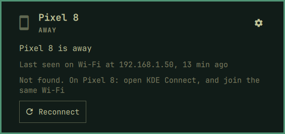

[Devices](../README.md) › Calls and devices

# Calls and devices

## Calls

A ringing phone rings in the bar, and a card names the caller.

A missed call stays, with *Call back* and *Text back*.

## Several devices

Each device gets a tab in the panel and a chip in the bar, shown always,
only with news, or never. `1`–`9` switch tabs.

Each one has its own page in Settings: nickname, icon, its place in the
bar, its tab, and Unpair.

## Away

When a device is not in reach, its page says where it was last seen and
offers *Reconnect*.

