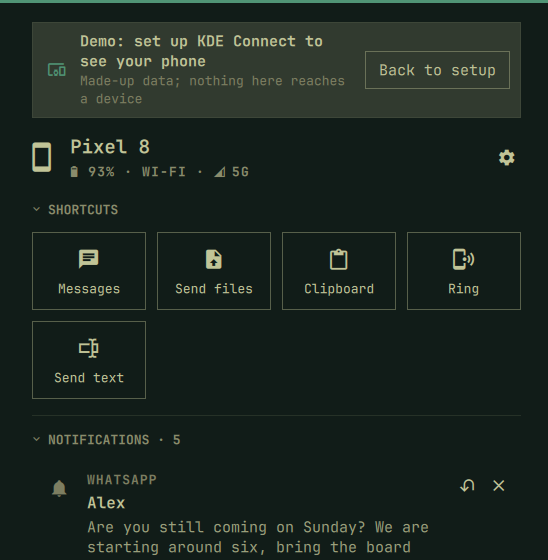

[Devices](../README.md) › Getting started

# Getting started

## Requirements

- Omarchy 4.
- KDE Connect on the computer: `sudo pacman -S --needed kdeconnect`.
- The KDE Connect app on the phone
  ([Google Play](https://play.google.com/store/apps/details?id=org.kde.kdeconnect_tp),
  [F-Droid](https://f-droid.org/packages/org.kde.kdeconnect_tp/)), on the
  same network.

## Install

```bash
omarchy plugin add https://github.com/sceny/omarchy-devices.git --enable
```

The pill lands on the right of the bar; move it with
`omarchy bar move sceny.devices --section right --index <n>`.

## Set up KDE Connect

Until a device is paired, the panel opens on **Add a device**: the steps
on it, and devices in reach to pair with. **Connection** (in Settings)
checks this computer (KDE Connect, the firewall, the network), with a
**Fix** where it can; fixes ask for your password.

**Preview with a demo phone**, under the steps, shows the panel with
made-up data until yours is set up; nothing reaches a device.



On the phone (*Add a device* shows a QR code to scan for the app):

1. Open KDE Connect, pick the computer and pair.
2. Grant **notification access**, **SMS**, **contacts** (names instead of
   numbers) and **media control**.
3. On Samsung, set the app's battery use to *Unrestricted*.

<details><summary>The firewall by hand</summary>

KDE Connect uses ports 1714–1764. Allow them from your home network only
(use your own range):

```bash
sudo ufw allow from 192.168.1.0/24 to any port 1714:1764 proto tcp comment 'KDE Connect'
sudo ufw allow from 192.168.1.0/24 to any port 1714:1764 proto udp comment 'KDE Connect'
```

</details>

## Update and remove

```bash
omarchy plugin update sceny.devices
omarchy plugin remove sceny.devices
```

Removing keeps KDE Connect, its pairing and the firewall rule. Delete
`~/.cache/sceny.devices/` to clear the caches.
