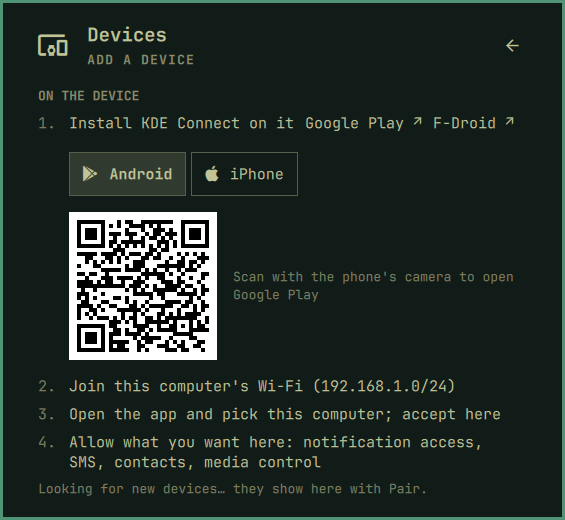
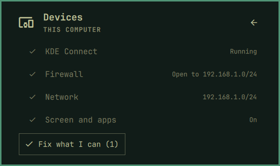

[Devices](../README.md) › Getting started

# Getting started

## Install

You need Omarchy 4 and the phone on the same network. What the computer is
missing (KDE Connect; scrcpy and adb for the screen; sshfs for the
gallery), the panel installs on a click, after a card says what.

```bash
omarchy plugin add https://github.com/sceny/omarchy-devices.git --enable
```

## Add your phone

Until a phone is paired, the panel opens on **Add a device**. Scan the
code with the phone's camera to get the app, Android or iPhone, then pick
this computer in the app and accept here.



Once paired, its page shows what it can do: one switch per feature does
every step it can, here and on the phone, and says the one left to you
(a permission to allow). An iPhone or iPad shares files and the clipboard
only.

## Check this computer

**This computer** checks KDE Connect, the firewall, the network and the
tools the screen and the gallery need, with a fix for each, or *Fix all*. Before a password, a card says exactly
what it is for.



## Look around first

**Preview with a demo phone** shows the panel with made-up data. Nothing
reaches a device.


## Update and remove

```bash
omarchy plugin update sceny.devices
omarchy plugin remove sceny.devices
```

Removing keeps KDE Connect and its pairing. Delete
`~/.cache/sceny.devices/` to clear the caches.
