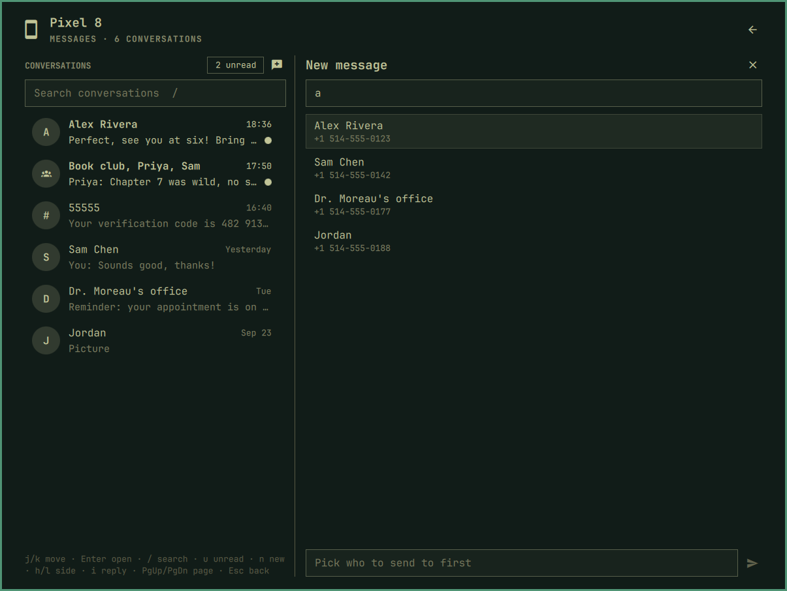
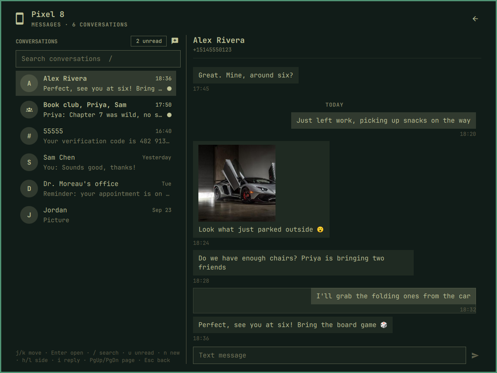

[Devices](../README.md) › Messages

# Messages

Middle-click the pill, or pick *Messages* in the panel.

Every conversation, with unread marks, a filter and search. History loads
as you scroll; pictures open full size. Drafts wait while you switch.

## A new message

Type a name or a number. Esc closes the suggestions and keeps what you
typed, so a short code works too.

## By keyboard

`l` moves into the conversation, where a highlight goes from message to
message; Enter opens its picture or copies its text. `h` or Esc comes back.

| Key | Action |
|---|---|
| `j` `k` · `g` `G` | Move · first, last |
| `l` `h` | Into the conversation · back |
| Enter | Open and reply; on a message: its picture, or copy |
| `/` · `u` · `n` · `i` | Search · unread · new · reply |
| PgUp PgDn | A page |
| Esc | Back |

Only your own click or Enter puts the cursor in the reply field.
