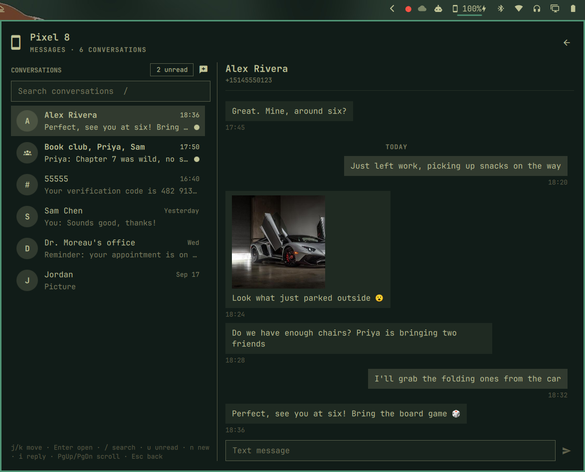

[Devices](../README.md) › Messages

# Messages



Middle-click the pill, or pick *Messages* in the panel.

- Every conversation, newest first, with unread marks, an unread filter and
  search over names, numbers and text.
- The whole history loads as you scroll up; picture messages open full
  size.
- Reply, or start a new message with a search over your contacts.
- The last conversation you had open comes back; drafts wait while you
  switch.

## Keys

| Key | Action |
|---|---|
| `j` `k` · `g` `G` | Move · first, last |
| Enter | Open and reply |
| `/` · `u` · `n` | Search · unread only · new message |
| `i` | Reply to the open conversation |
| PgUp PgDn | Scroll the conversation |
| Esc | Back |

In the reply field, Enter sends and Esc steps back. Nothing but your own
click or Enter puts the cursor there.

## Text someone from a key

Bind a key (in `~/.config/hypr/bindings.lua`) to open a new message with
your contacts listed; pick one with the arrows and Enter, or type a name:

```lua
o.bind("SUPER + SHIFT + T", "Text someone", "qs -p /usr/share/omarchy/shell/shell.qml ipc call sceny.devices textSomeone")
```

Or add it to the Omarchy menu (`~/.config/omarchy/extensions/omarchy-menu.jsonc`):

```jsonc
"text-someone": {"icon":"󰍩","label":"Text someone","action":"qs -p /usr/share/omarchy/shell/shell.qml ipc call sceny.devices textSomeone"},
```
