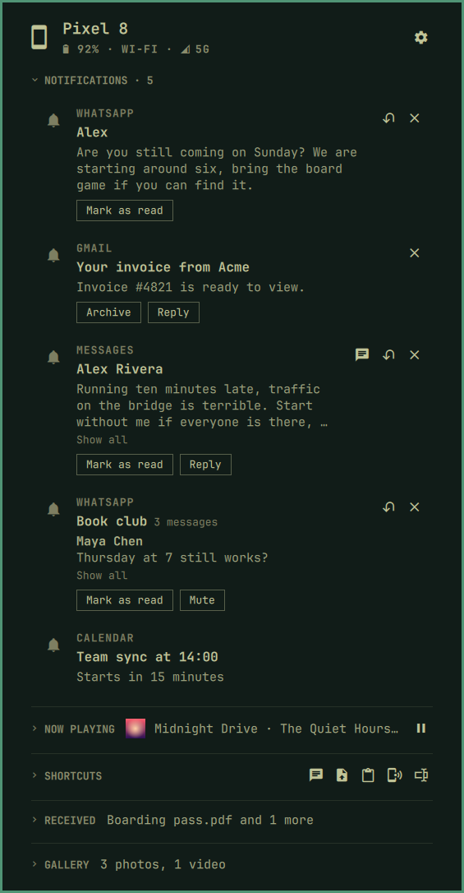
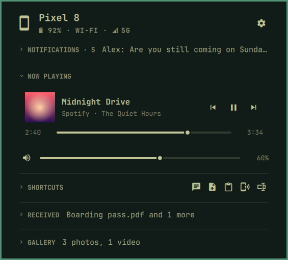
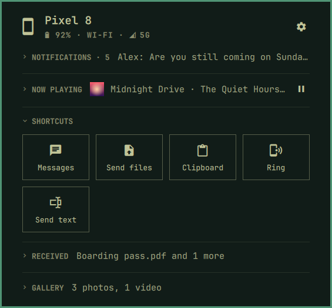
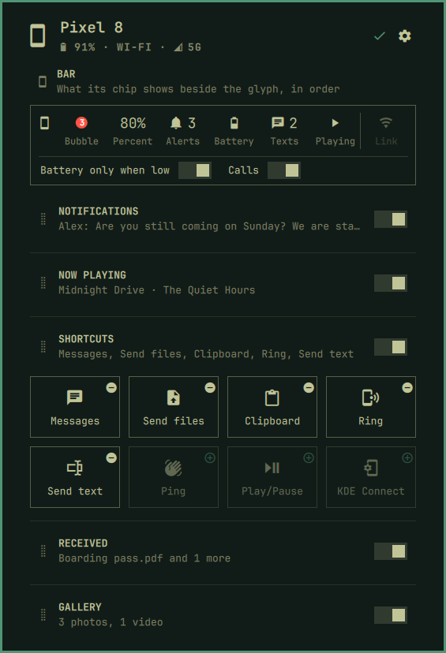

[Devices](../README.md) › The panel

# The panel

Click the pill. Every section folds to one line.

## Notifications

Reply, dismiss, or press the app's own buttons. A chat shows who said what.

## Now playing

The phone's active player: seek, skip, volume. The others are a swipe or
`h` `l` away.

## Shortcuts

Messages, send files, the clipboard, ring it, send a text or a link.

## Make it yours

Press `E` (or right-click the page): choose what the chip in the bar
shows, order and hide sections, pick shortcuts. ✓ keeps it; Esc undoes.

## Keys

| Key | Action |
|---|---|
| `j` `k` / arrows · PgUp PgDn | Move · a page |
| `h` `l` | Along the shortcuts, through the players |
| Enter | Activate; play/pause on the player |
| `[` `]` · `,` `.` · `-` `=` | Skip · seek 10 s · volume |
| `r` · `x` · `e` | Reply · dismiss · show all |
| `s` · `E` · Esc | Settings · edit · back |
