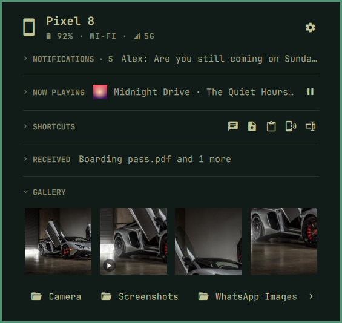
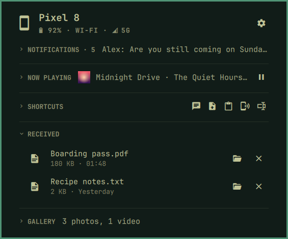

[Devices](../README.md) › Photos and files

# Photos and files

## Gallery

The phone's newest photos and videos, as its own gallery finds them.
Click one to open it; from a corner, copy it or save it in
`Pictures/<device>`; or drag it into a window. Below, the biggest albums
open in Files.

The Gallery needs `sshfs` (the section offers to install it) and storage
access in the app. A ring by its title means the phone is being read.

## Received

Files the phone sent you: open one, show it in Files, or forget it. A file
you rename, move or delete there follows here.

## Opened safely

A picture from the phone opens as a copy made in a sandbox from its
pixels, so your viewer never reads the phone's file. One that cannot be
read that way is not opened.
