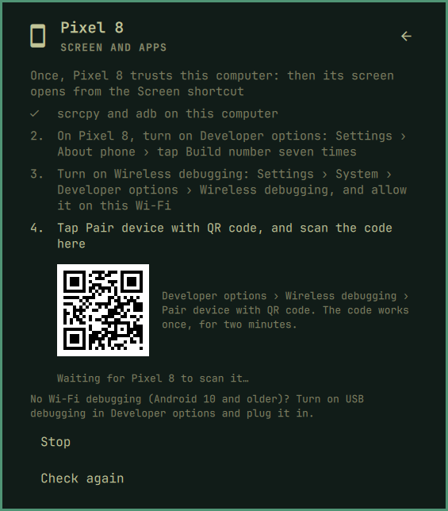

[Devices](../README.md) › Screen and apps

# Screen and apps

The phone's screen in a window here, used with your mouse and keyboard:
the **Screen** shortcut. It comes from [scrcpy](https://github.com/Genymobile/scrcpy),
not KDE Connect, and is set up once per device.

## Set it up

Open **Settings › Screen and apps** on the device's page, or
*Connection › Set up a device*.

1. **Install** scrcpy and adb. *Connection* offers it too; it asks for
   your password.
2. On the phone, turn on **Developer options**: *Settings › About phone*
   (Samsung: *› Software information*) › tap *Build number* seven times.
3. Turn on **Wireless debugging** in *Developer options*, on this Wi-Fi.
4. **Show the code** here, then on the phone *Wireless debugging › Pair
   device with QR code* and scan it.

That is once. The **Screen** shortcut then joins the device's shortcuts
(take it away with ✎ if you like) and opens the window.

It opens **docked**: the panel grows into the device's own shape under
its chip and the screen appears there, on every workspace. Choose *Opens as a window* on its Screen and
apps page for a window like any other (it moves at once).

Android 10 and older have no Wireless debugging: turn on *USB debugging*
and plug the phone in.

## When it stops working

- *Wireless debugging is off*: Android turns it off on another Wi-Fi or
  after a restart. Turn it on again; a *Quick settings developer tile*
  for it makes that one tap.
- *Allow USB debugging*: answer the prompt on the phone, with *Always
  allow from this computer*.

## Privacy

Wireless debugging lets this computer control the phone. Only a computer
that scanned your code can, and you can take that back on the phone:
*Developer options › Revoke USB debugging authorizations*.
