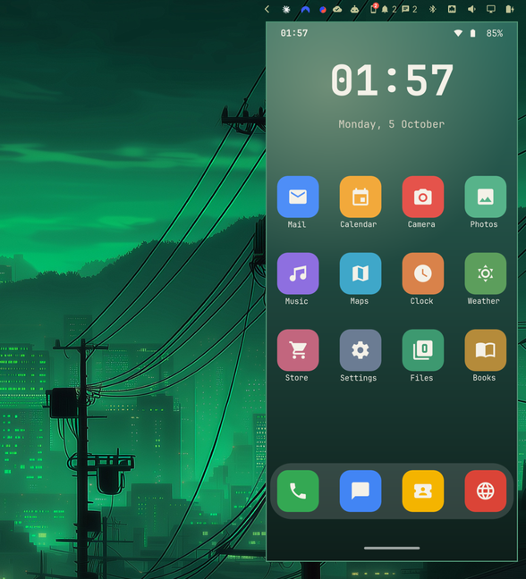
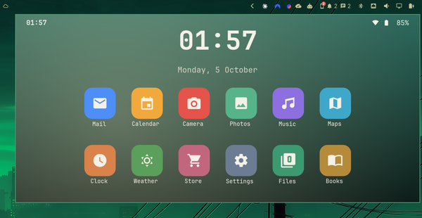

[Devices](../README.md) › Screen and apps

# Screen and apps

The phone's screen on your desktop, and each of its apps in a window of its
own: use them with your mouse and keyboard while the phone stays in your
pocket.

## Its screen

The **Screen** shortcut opens it **docked**: under its chip in the bar, in
the phone's own shape, on every workspace. Or as a window like any other.

- **It turns with the phone.** Sideways, or a foldable opened: the window
  takes the new shape as the phone does.
- **Your keyboard and mouse.** Type, scroll; right-click is Back,
  middle-click is Home. Copy on one side, paste on the other; drop a file
  on it to send it to the phone's Downloads.
- **Full screen:** Omarchy's pop-out key, then its full screen key (the
  panel shows your keys).
- **Back by itself.** After the phone restarts, it opens again as soon as
  Wireless debugging is back.

## Its apps

Each app in a window of its own, tiled, with its icon, while the phone's
screen stays free: a map beside your browser, a chat beside your editor.
Shift+Enter or Shift+click opens one popped out instead.
[More on apps](apps.md).

## Set it up

Once per phone, from the panel: [Setup › Screen and apps](setup/screen-and-apps.md).
What Wireless debugging allows: [Security](security.md#the-screen-and-apps-what-wireless-debugging-allows).
