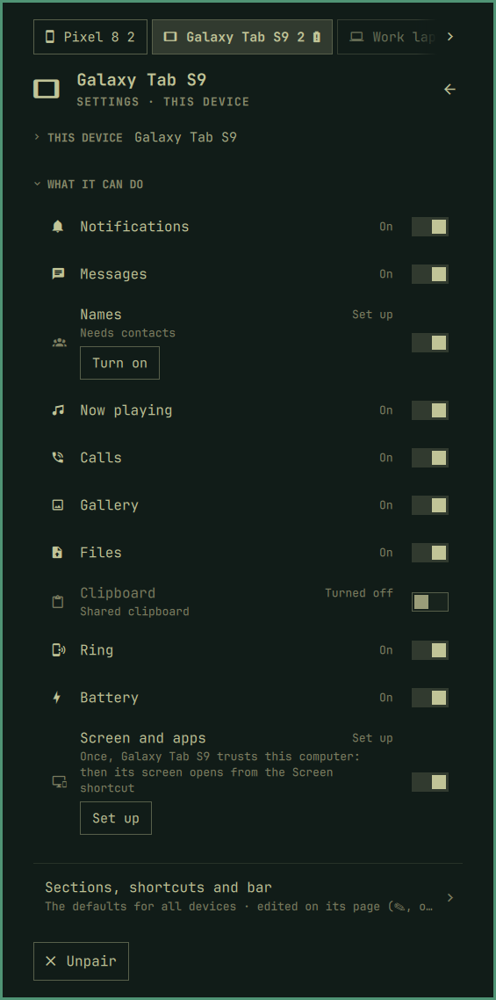

[Devices](../../README.md) › Setup › Your devices

# Your devices

Each paired device has its own page in Settings, with tabs to the next:
its nickname and icon, where it shows (with two or more: always, only with
news, or never; a tab or not), **what it can do**, and Unpair.

## What it can do

A row per feature, *On* or what it still needs. One switch gets it working:
it does every step the plugin can, here and on the device, this computer's
packages first (a card says what before the password), and says the one
left to you. It then carries on by itself once that is done. The switch
also turns a feature off for that device.

| Feature | What it needs |
|---|---|
| Notifications, Now playing | Notification access on the phone |
| Messages · Names · Calls | SMS · contacts · phone and call log |
| Gallery | All files access; `sshfs` here |
| Screen and apps | scrcpy and adb here; [Wireless debugging](screen-and-apps.md) |
| Calls here | Bluetooth here; the phone [paired over Bluetooth](calls-here.md) |
| Files, Clipboard, Ring, Battery | KDE Connect alone |

With the screen set up, the plugin allows a permission over adb itself;
without it, the row says where the switch is on the phone.

## Several devices

Drag a device by its grip in Settings' *My devices* to order them: the
first opens with the panel. *For all devices* sets the sections, shortcuts
and bar of devices that did not change their own. Unpair asks twice.
New one: [Getting started](getting-started.md#add-your-phone).
