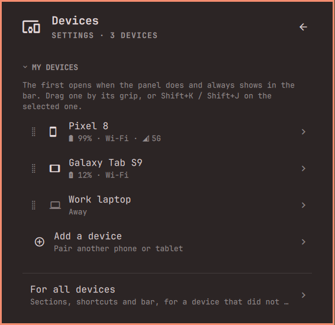

[Devices](../../README.md) › Setup › Your devices

# Your devices

Each paired device has its own page in Settings: its nickname and icon,
where it shows (with two or more: always, only with news, or never; a tab
or not), **what it shares with this computer**, and Unpair.

## What it needs, asked where you use it

Nothing is set up ahead. A feature that needs something asks once, in the
place it shows, and goes on by itself when it is done.

| Feature | Asked when |
|---|---|
| Notifications, Now playing | Notifications: allow notification access |
| Screen and apps | The first **Open** on a notification, the Screen shortcut: [Wireless debugging](screen-and-apps.md) |
| Gallery | Its section: all files access |
| Messages, Contacts | The Messages and Contacts pages: SMS, contacts |
| Calls | On the phone, when KDE Connect asks for the phone and call log |
| Files, Clipboard, Ring, Battery | Never: they just work |

With the screen set up, the panel sees what is missing and *Allow* grants
it from here.

When something that worked stops, it says so in its section, with *Fix*,
*Details* and *Fix with AI*. A device that is not Android (an iPhone) shows
only what it can do.

## Several devices

Drag a device by its grip in Settings' *My devices* to order them: the
first opens with the panel. *For all devices* sets the sections, shortcuts
and bar of devices that did not change their own. Unpair asks twice.
New one: [Getting started](getting-started.md#the-first-time).
