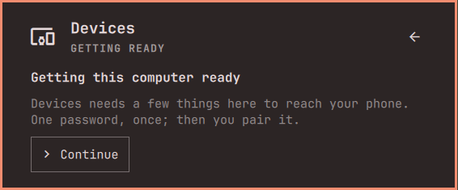

[Devices](../../README.md) › Setup › Getting started

# Getting started

Install it, open it, follow your phone. Nothing to set up by hand.

## Install

You need Omarchy 4 and the phone on the same network.

```bash
omarchy plugin add https://github.com/sceny/omarchy-devices.git --enable
```

## The first time

The panel gets this computer ready in one step: one password, once, after
a card lists what it installs. No package is asked for again.



Then **Add a device**: scan the code with the phone's camera to get the
app, Android or iPhone, pick this computer in the app and accept here.


Paired, the panel shows your phone. What a feature still needs, it asks
where you use it: notification access in Notifications, the screen the
first time you press **Open**. Each is asked once.

## Look around first

**Preview with a demo phone** shows the panel with made-up data. Nothing
reaches a device.


## Update and remove

```bash
omarchy plugin update sceny.devices
omarchy plugin remove sceny.devices
```

Removing keeps KDE Connect and its pairing. Delete
`~/.cache/sceny.devices/` to clear the caches.
