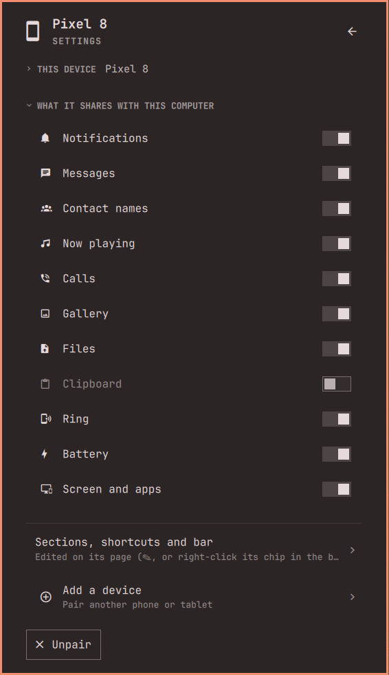

[Devices](../../README.md) › Setup › Settings

# Settings

Press `s` or the cog. Settings starts with whether everything works, and
lists what needs you with *Fix all* and *Fix with AI* (your coding agent
opens on it: [what it may do](../security.md#fix-with-ai)). The main page shows a red line too.

- **My devices:** open one for its page, with what it can do
  ([Your devices](devices.md)); drag by the grip to reorder.
- **Sections, shortcuts and the bar** are edited on the page itself (`E`).
  With two or more devices, *For all devices* sets them for devices that
  did not change them.
- **This computer:** KDE Connect, the firewall, the network, the mesh, the screen's
  and gallery's tools. *Ignore* one you will not fix.
- **Add a device** pairs a new one, then shows what it can do
  ([Getting started](getting-started.md#add-your-phone)).
- **A password** is asked only after a card says what for: the packages by
  name, the firewall rule as written. Nothing else runs with it.

## What is kept

| What | Where |
|---|---|
| Layout, folds, bar, shortcuts, each device's nickname and order | Omarchy's `shell.json` |
| Thumbnails, received files, copies of opened files | `~/.cache/sceny.devices/` |
| Drafts, where the panel was | Memory only |

Change settings in the panel, not in `shell.json` while the shell runs.
