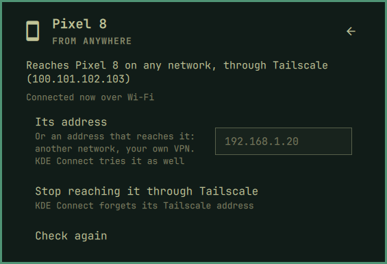

[Devices](../../README.md) › Use it › From anywhere

# From anywhere

Your phone in the panel at the office, on a hotel's Wi-Fi or on mobile
data: notifications, messages, media and files, as at home.

- **Through a mesh**: Tailscale, free for personal use; NordVPN Meshnet
  works the same way if you have it. Your phone keeps one address on it
  wherever it is, and the panel gives that address to KDE Connect.
- **Or an address** you type: another network, your own VPN.
- **How it is connected now** shows on its page: *Wi-Fi*, *Tailscale*.
- **A new network** (another Wi-Fi, a cable) is announced at once, so the
  phone connects back without waiting.
- **Away, it says why** when it can: a Wi-Fi that keeps its devices apart
  (guest or office Wi-Fi) is named as the likely cause.

On the card of a device that is away: **From anywhere**.

Setup: [From anywhere](../setup/anywhere.md) · Limits: [What it cannot do](../setup/limits.md#from-anywhere)
