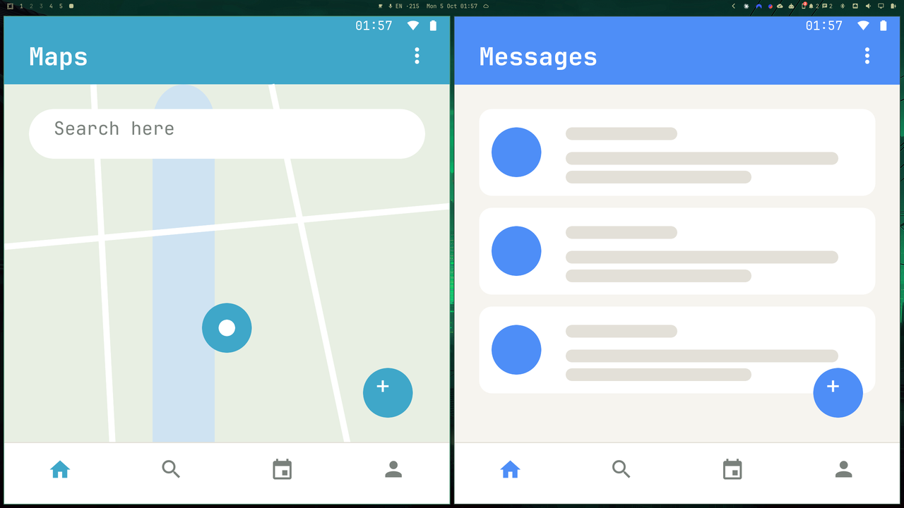
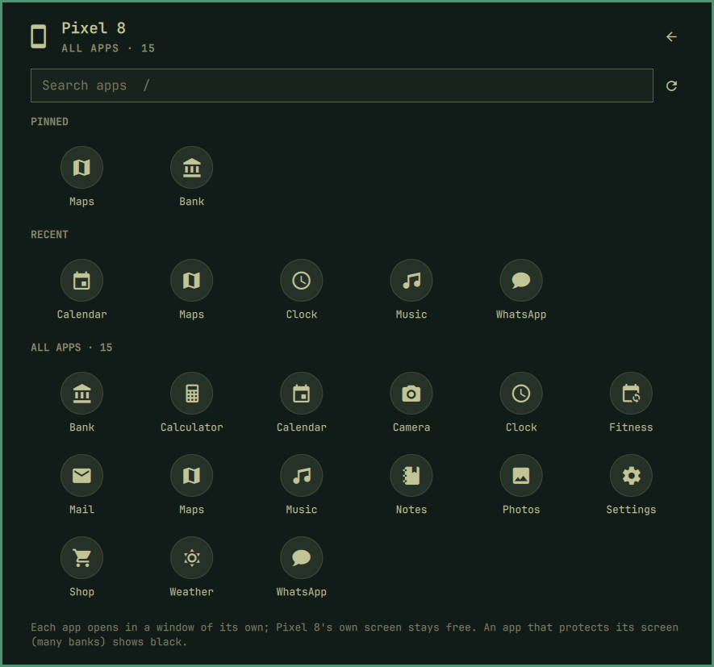

[Devices](../../README.md) › Use it › Apps

# Apps

Any app on the phone, in a window of its own here, tiled with the rest,
with its own icon, while the phone's screen stays free: a map beside your
browser, a chat beside your editor. Type with your keyboard; the phone's
on-screen keyboard never shows.

Pick them from the Apps section of the panel, or from **All apps**:

- **Apps** on the main page: two rows, **Pinned** and **Recent**.
  **All apps** (`a`) has every app; type to search (`/`).
- **Pin** an app by dragging it into Pinned, where you drop it (or hover
  it and click its pin, or `p`). Drag pinned apps to reorder them
  (`Shift+H` / `Shift+L`); drag one out to unpin it. ✕ (or `x`) takes a
  recent one out until you open it again.
- **A notification** opens its app in a window (its window button, or `o`).
- **Popped out** instead of tiled, floating at the top right:
  **Shift+Enter** or Shift+click.
- **Sound:** here, or left on the phone (*Screen and apps* page). While
  something else plays on the phone, say music in your headset, an app's
  sound stays there.
- **Locked,** the phone wakes and the app opens once you unlock it.

## Keys

| Key | Action |
|---|---|
| `a` · `/` | All apps · search |
| Enter · Shift+Enter | Open · open popped out |
| `p` · `x` · `Shift+H` `Shift+L` | Pin · forget a recent one · move a pinned one |

Setup: [Screen and apps](../setup/screen-and-apps.md) · Limits: [What it cannot do](../setup/limits.md)
