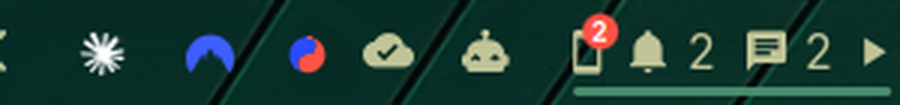

[Devices](../../README.md) › Use it › The bar

# The bar

A glance at the bar tells you what the phone would: a pill with its
glyph and the marks you choose. Out of the box it stays quiet, showing its
battery only when it runs low and a bubble only when notifications wait.

- **Marks to pick from:** the link (crossed out while away), the battery
  as a glyph and as a number, notifications, unread texts, a play mark
  while something plays, the bubble. Nothing shows at zero; away, nothing
  stale. Pick them and their order on the page itself: [Make it yours](edit.md).
- **A call** rings in it, and a missed one stays until you close it.
- **Click** opens the panel; **middle-click** opens [Messages](messages.md);
  **right-click** edits the page.
- **Several devices:** a pill each, shown always, only with news, or never:
  [Several devices](devices.md).
