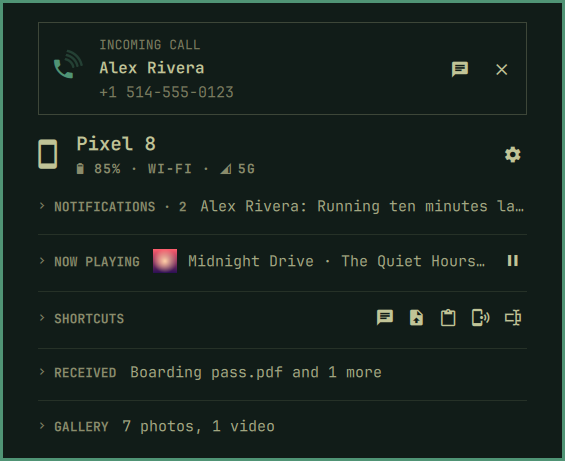
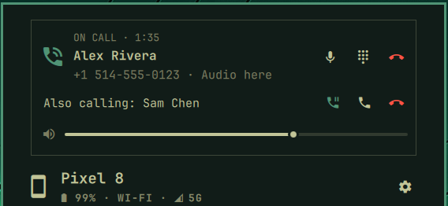
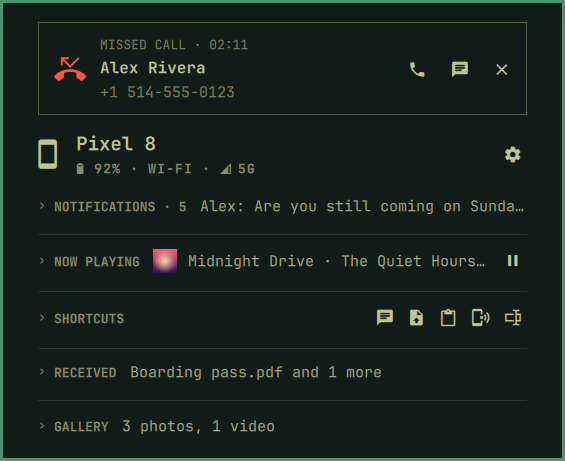

[Devices](../../README.md) › Use it › Calls

# Calls

When the phone rings, the bar rings with it, and a card names who is
calling, by the name the phone has for them. With **Calls here** set up,
you answer at the computer and talk through its speakers and microphone,
or your headset.

## Ringing

*Answer here* brings the call's audio to this computer; *Answer on the
phone* answers and leaves it there. *Text instead* starts a
[message](messages.md); *Decline* ends it.

## On a call

The card counts the time and says where the audio is. Turn the
microphone off, bring the audio here, open the keypad for a menu's
tones, set the volume, hang up. A second call shows under the first:
hold this one and answer, end it and answer, or decline; with one on
hold, swap them or join them. Music playing here pauses for the call and
plays again after it.

## Missed, and calling

A missed call stays until you close it, with *Call back* and *Text back*.
Call back, or the phone icon on a conversation in
[Messages](messages.md), places the call from here; without Calls here,
it opens on the phone's dialer.

Setup: [Calls here](../setup/calls-here.md) · Limits: [What it cannot do](../setup/limits.md)
