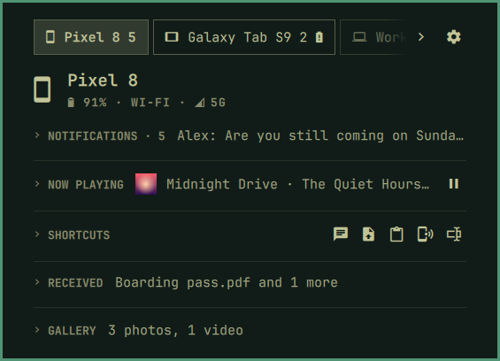

[Devices](../../README.md) › Use it › Several devices

# Several devices

A phone, a tablet, a second phone: each has a tab in the panel and a pill
in the bar, with its own news, and keeps its own sections, shortcuts and
bar marks, or shares the defaults.

- **Tabs** switch (`1`–`9`, `Shift+H` / `Shift+L`); drag one to reorder,
  and the pills follow. The first opens with the panel.
- **A pill** shows always, only with news, or never, per device.
- **Away,** a device keeps its tab; its page says where it was last seen
  and offers *Reconnect*.

Setup: [Your devices](../setup/devices.md)
