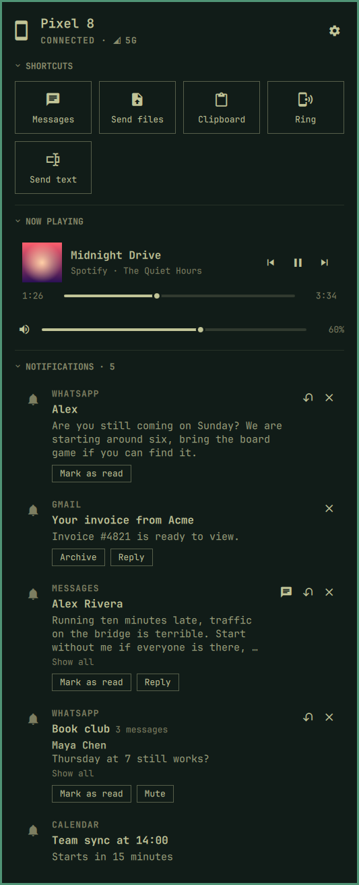

[Devices](../../README.md) › Use it › The panel

# The panel

One click on the pill, and the phone is open on your desktop: its
shortcuts and apps, its notifications, what it plays, the files it sent
you and its newest photos, in the order you choose. Every section folds
to one line that still works, so the panel is as tall as you want it.

- [Shortcuts](shortcuts.md) · [Apps](apps.md) ·
  [Notifications](notifications.md) · [Now playing](now-playing.md) ·
  [Received](received.md) · [Gallery](gallery.md).
- **Folded,** Shortcuts stay a row of icons that work, Now playing keeps
  its cover and a play button, the others keep their count.
- **Opened again within five minutes,** it is where you left it: the page,
  the scroll, the conversation. Later, it opens fresh.
- **When something needs you,** a red line at the top says what and opens
  [Settings](../setup/settings.md); ✕ closes it until something new does.
- **Pick, order and hide** the sections on the page itself:
  [Make it yours](edit.md).

## Keys

| Key | Action |
|---|---|
| `j` `k` / arrows · PgUp PgDn | Move · a page |
| Enter · Esc | Activate · back to where you came from, then close |
| `0` | Home: the main page, from two pages deep |
| `c` | Fold the section under the cursor |
| `s` · `E` · `m` · `a` | Settings · edit the page · messages · all apps |

Every key: [The keyboard](keyboard.md).
